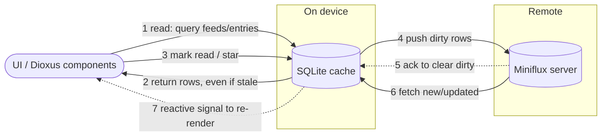
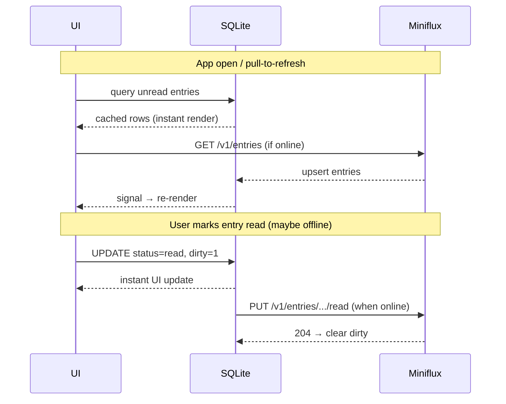

# RSSH

RSS client for Android (supported for Miniflux backend).

## Logic

```mermaid
flowchart LR
  UI([UI / Dioxus components])

  subgraph Device[On device]
      Cache[(SQLite cache)]
  end

  subgraph Remote
      MF[(Miniflux server)]
  end

  %% read path — offline-first
  UI -->|1 read: query feeds/entries| Cache
  Cache -->|2 return rows, even if stale| UI

  %% write path — optimistic + write-back
  UI -->|3 mark read / star| Cache
  Cache -->|4 push dirty rows| MF
  MF -.->|5 ack to clear dirty| Cache

  %% pull sync
  MF -->|6 fetch new/updated| Cache
  Cache -.->|7 reactive signal to re-render| UI
```

```mermaid
sequenceDiagram
  participant UI
  participant Cache as SQLite
  participant MF as Miniflux

  Note over UI,MF: App open / pull-to-refresh
  UI->>Cache: query unread entries
  Cache-->>UI: cached rows (instant render)
  UI->>MF: GET /v1/entries (if online)
  MF-->>Cache: upsert entries
  Cache-->>UI: signal → re-render

  Note over UI,MF: User marks entry read (maybe offline)
  UI->>Cache: UPDATE status=read, dirty=1
  Cache-->>UI: instant UI update
  Cache->>MF: PUT /v1/entries/.../read (when online)
  MF-->>Cache: 204 → clear dirty
```
